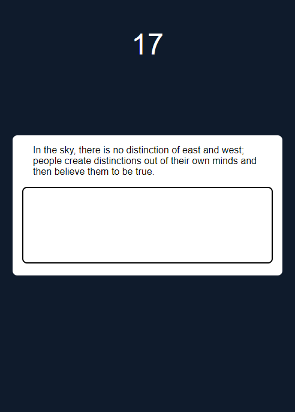
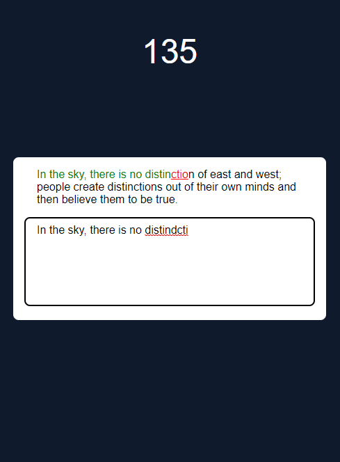

## Table of contents

- [Overview](#overview)
  - [The challenge](#the-challenge)
  - [Screenshot](#screenshot)
  - [Links](#links)
- [My process](#my-process)
  - [Built with](#built-with)
  - [Notes](#notes)
  - [Useful resources](#useful-resources)
- [Author](#author)
- [Contributing](#contributing)
- [License](#license)

## Overview
  typing game that will only move to next quote when current is correct

### Screenshot

Mobile Screenshot



Desktop Screenshot



### Links

- Solution URL: [Github](https://github.com/SteveNoyes/typingGame)
- Live Site URL: - [GitHub Pages](https://stevenoyes.github.io/typingGame/)

## My process

### Built with

- JavaScript
- CSS3
- HTML/Emmet
- VSCode

### Notes

```html
      <div class="quoteDisplay" id="quoteDisplay"></div>
    <textarea id="quoteInput" class="quote-input" autofocus></textarea>
```
```js
  arrayQuote.forEach((characterSpan, index) => {
    const character = arrayValue[index]
    if (character == null) {
      characterSpan.classList.remove('correct')
      characterSpan.classList.remove('incorrect')
      correct = false
    } else if (character === characterSpan.innerText) {
      characterSpan.classList.add('correct')
      characterSpan.classList.remove('incorrect')
    } else {
      characterSpan.classList.remove('correct')
      characterSpan.classList.add('incorrect')
      correct = false
    }
  })
```
```js
con RANDOM_QUOTE_API_URL = 'http://api.quotable.io/random';
```
### Useful resources

- [Reset CSS](https://meyerweb.com/eric/tools/css/reset/) - I use this for most projects to start with a 'clean' area to build.  

- [Text & Word Spacing](https://www.w3schools.com/css/css_text_spacing.asp) - Still didn't get this pixel perfect to my spec. but I think it works.

- [Changing Image at Media Query](https://stackoverflow.com/questions/2182716/is-it-possible-to-set-the-equivalent-of-a-src-attribute-of-an-img-tag-in-css) - Changing at media query was something I went back and forth on. I ended up copying everything and remaking it desktop first and then merged the two. 

## Author

- Website - [Steven Noyes](https://www.stevenmnoyes.com)
- LinkedIn - [Steven Noyes](https://www.linkedin.com/in/steven-noyes/)

## Contributing
Pull requests are welcome. For major changes, please open an issue first to discuss what you would like to change.

## License

Copyright (c) [2022] [SteveNoyes]

Permission is hereby granted, free of charge, to any person obtaining a copy
of this software and associated documentation files (the "Software"), to deal
in the Software without restriction, including without limitation the rights
to use, copy, modify, merge, publish, distribute, sublicense, and/or sell
copies of the Software, and to permit persons to whom the Software is
furnished to do so, subject to the following conditions:

The above copyright notice and this permission notice shall be included in all
copies or substantial portions of the Software.

THE SOFTWARE IS PROVIDED "AS IS", WITHOUT WARRANTY OF ANY KIND, EXPRESS OR
IMPLIED, INCLUDING BUT NOT LIMITED TO THE WARRANTIES OF MERCHANTABILITY,
FITNESS FOR A PARTICULAR PURPOSE AND NONINFRINGEMENT. IN NO EVENT SHALL THE
AUTHORS OR COPYRIGHT HOLDERS BE LIABLE FOR ANY CLAIM, DAMAGES OR OTHER
LIABILITY, WHETHER IN AN ACTION OF CONTRACT, TORT OR OTHERWISE, ARISING FROM,
OUT OF OR IN CONNECTION WITH THE SOFTWARE OR THE USE OR OTHER DEALINGS IN THE
SOFTWARE.